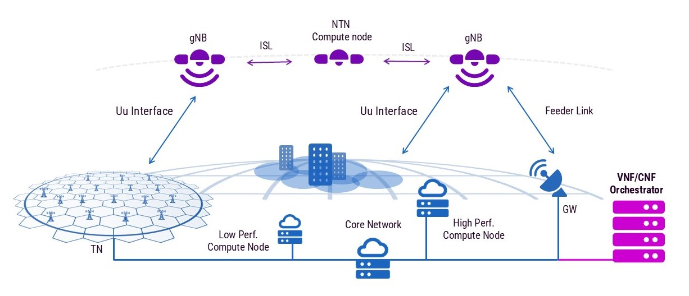
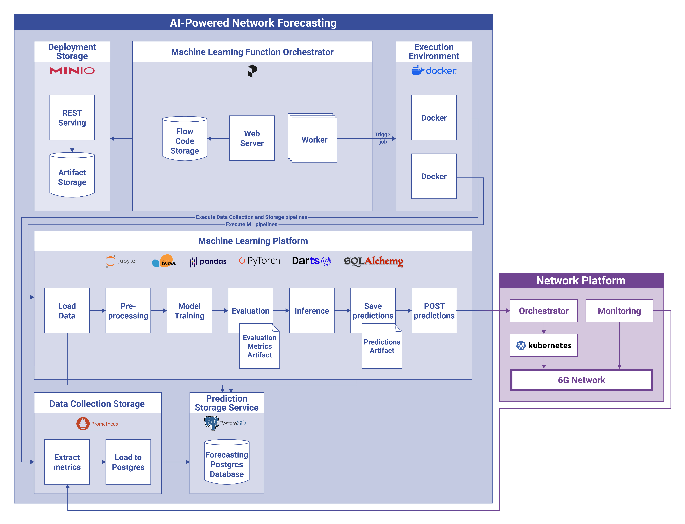
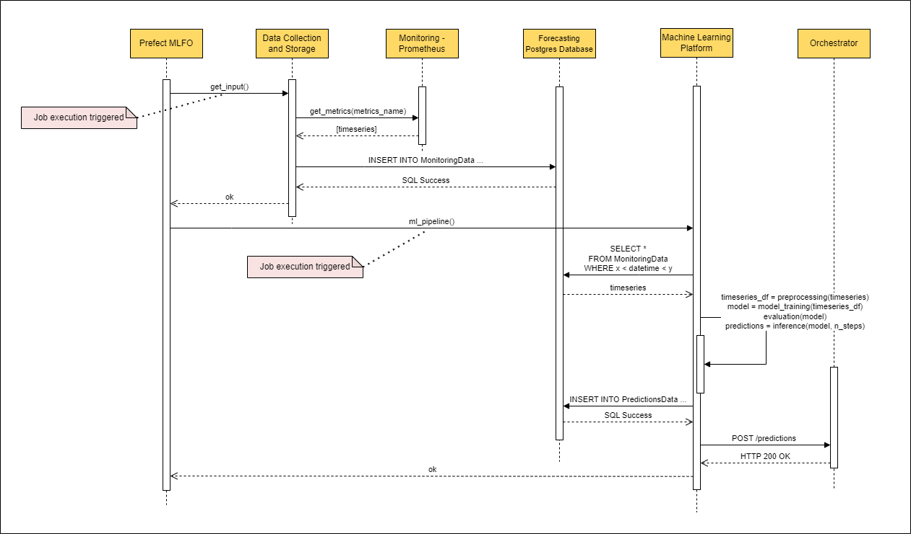
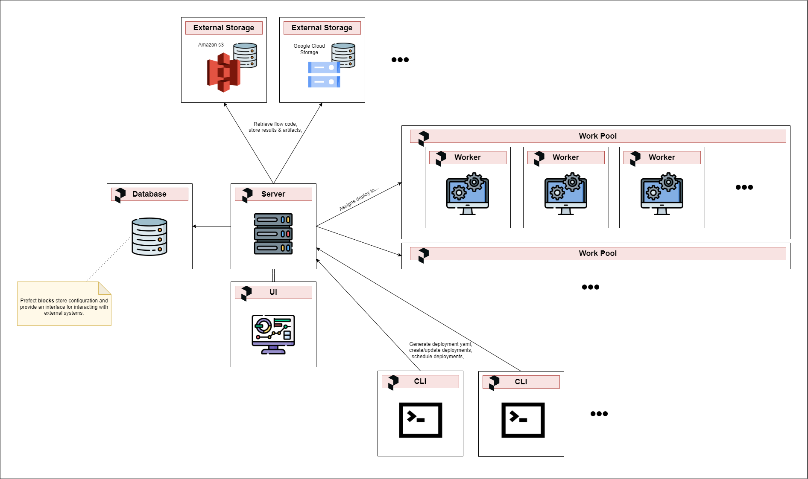

# Resource Forecasting in 6G Non-Terrestrial Networks (6G-NTN)


## Table of Contents

- [📖 Introduction](#introduction)
- [⚙️ Installation](#installation)
- [🏛️ Architecture](#architecture)
- [📉 Sequence Diagram](#sequence-diagram)
- [🏗️ Prefect Distributed Architecture](#prefect-distributed-architecture)
- [📜 License](#license)
- [📌 Acknowledgement](#acknowledgement)

## 📖Introduction

Welcome to 6G-NTN-resource-forecasting project! This project leverages Machine Learning techniques to forecast resource allocation in the context of 6G Non-Terrestrial Networks (6G-NTN). Our goal is to develop ML solutions for resource forecasting, thereby enabling dynamic orchestration of virtual resources in 6G-NTN environments. Read the [article](https://www.martel-innovate.com/news/2024/08/06/resource-forecasting-in-6g-non-terrestrial-network/) if you want to know more!



## ⚙Installation

### Prerequisites:

- Docker>=24.0.7

### Setup

1. Clone the repository:
```
git clone https://github.com/martel-innovate/6G-NTN-resource-forecasting
cd 6G-NTN-resource-forecasting
```

2. Run Docker desktop

3. Start docker compose
```
cd src
docker-compose --profile compose-project up -d --build
```
It can take around 10 minutes, so you might want to grab a coffee ☕

This will start the following Docker containers:
- orchestrator
- forecasting-postgres-database
- metrics-exporter
- minio: check at http://localhost:9001/
- prefect-db
- prefect-orion: check at http://localhost:4200/
- prometheus: check at http://localhost:9090/

> **Note:** The project requires environment variables to be specified. Please add a `.env` file in the `src` directory following the `.env.example` file.


4. Build and run a prefect CLI
```
docker-compose run --build prefect-cli  
```

This will open a shell inside a Docker container. From here you can:

5. Create the work pool
```
prefect work-pool create LSTM_forecasting
```

Select type "Prefect Agent". Go to http://localhost:4200/work-pools: you should see the new work pool created.

6. Set MinIO storage
```
python scripts/set_block_storage.py
```

7. Upload scripts to MinIO
```
python scripts/load_minio.py
```
Check on MinIO UI if files have been added.

8. Deploy scripts
```
prefect deployment build scripts/load_postgres.py:get_input -n 'load_postgres' --pool 'LSTM_forecasting' -sb 'remote-file-system/minio' 
prefect deployment apply get_input-deployment.yaml  

prefect deployment build scripts/distributed_LSTM_univariate.py:ml_pipeline -n 'distributed_LSTM_univariate' --pool 'LSTM_forecasting' -sb 'remote-file-system/minio' 
prefect deployment apply ml_pipeline-deployment.yaml  

```

Go to http://localhost:4200/deployments and you should see the two deployments.

9. Exit Prefect CLI
```
exit
```

10. Start Prefect worker
```
docker-compose --profile prefect-worker up -d --build
```

11. Run scripts

Go to http://localhost:4200/deployments and using the UI execute a Quick Run.

If when running the deployment there is a popup asking for environmental variable, uncheck the box and click on run.

## 🏛Architecture

The AI-Powered Network Forecasting platform is essential for executing Machine Learning (ML) pipelines, enabling the automated training and retraining of ML models. ML and Deep Learning (DL) experiments are initiated by Prefect, a Machine Learning Function Orchestrator that orchestrates workflows utilizing a cloud-native infrastructure. The execution environment of Prefect flows is managed by Docker containers. 

In the picture below, you can see the system architecture of our platform.



## 📉Sequence Diagram

Below is the sequence diagram illustrating the workflow of data collection, storage, and prediction in our project:



## 🏗Prefect distributed architecture
Below is the architecture we used to interconnect Prefect components in a distributed environment. All components are deployed using Docker containers to ensure consistent and isolated execution environments.


## 📜License

This project is licensed under the GPL3.0 License. See the [LICENSE](LICENSE) file for more details.

## 📌Acknowledgement

This repository is part of the **6G-NTN** project. 6G-NTN project has received funding from the Smart Networks and Services Joint Undertaking (SNS JU) under the European Union’s Horizon Europe research and innovation programme under Grant Agreement No 101096479. This work has received funding from the Swiss State Secretariat for Education, Research and Innovation (SERI). Views and opinions expressed are however those of the author(s) only and do not necessarily reflect those of the European Union. Neither the European Union nor the granting authority can be held responsible for them. For more details about the project, visit the [6G-NTN project website](https://www.6g-ntn.eu/) or the [6G-NTN LinkedIn page](https://www.linkedin.com/company/6g-ntn/).


 
