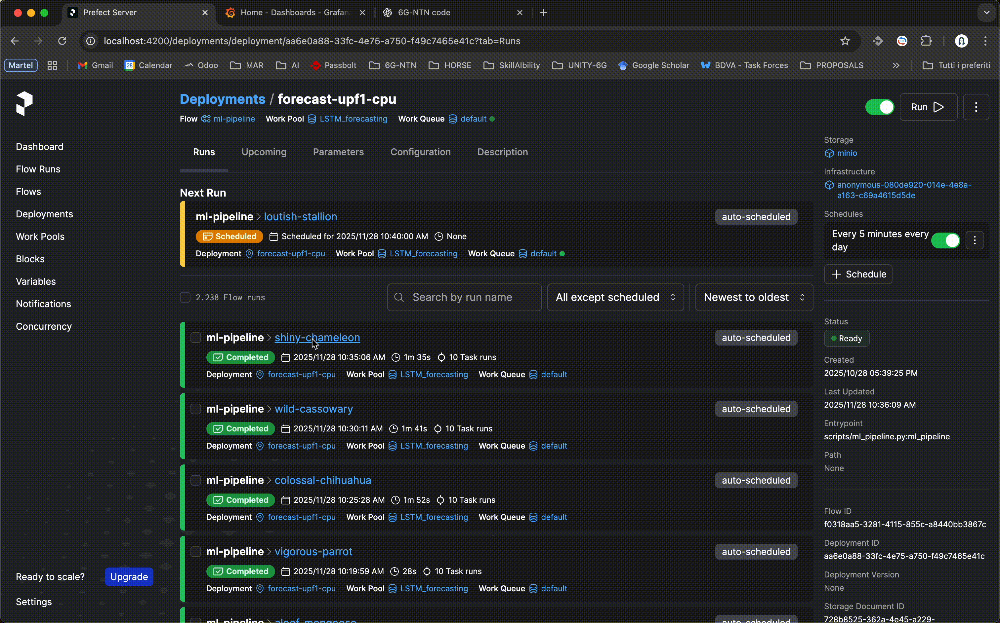
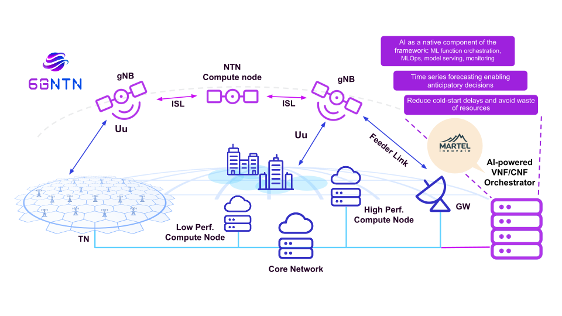
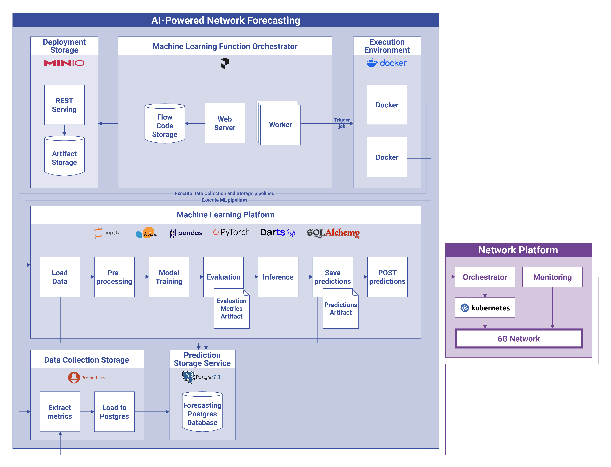
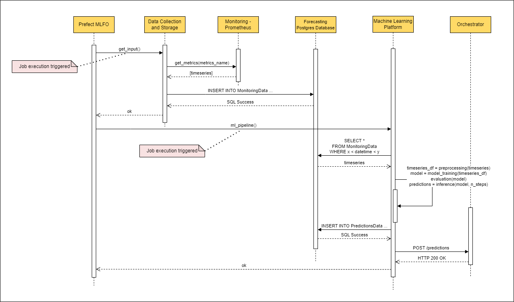
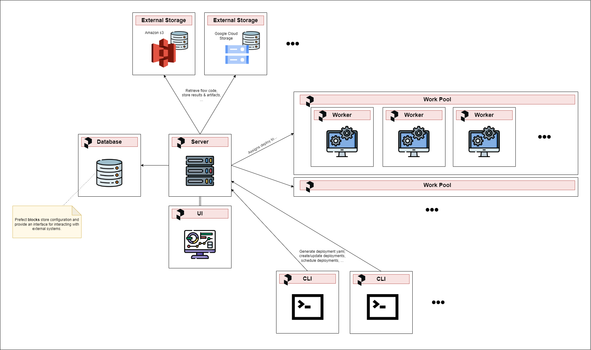

# Resource Forecasting in 6G Non-Terrestrial Networks (6G-NTN)



## Table of Contents

- [📖 Introduction](#introduction)
- [⚙️ Installation](#installation)
- [🏛️ Architecture](#architecture)
- [📉 Sequence Diagram](#sequence-diagram)
- [🏗️ Prefect Distributed Architecture](#prefect-distributed-architecture)
- [📜 License](#license)
- [📌 Acknowledgement](#acknowledgement)

## 📖Introduction

Welcome to 6G-NTN-resource-forecasting project! 
This repository presents the **6G-NTN Resource Forecasting**, a platform leveraging Machine Learning (ML) techniques to enable proactive resource allocation and dynamic orchestration of Virtual/Cloud-native Network Functions (VNF/CNF) resources within **6G Non-Terrestrial Networks (6G-NTN)** environments. The solution integrates a cloud-native infrastructure with Prefect for workflow orchestration to manage ML pipelines, ensuring automated model training and inference for resource demand forecasting.

Read the [article](https://www.martel-innovate.com/news/2024/08/06/resource-forecasting-in-6g-non-terrestrial-network/) if you want to know more!

This work is part of ongoing research, and the methodology, experiments, and results have been published in the following paper: [Proactive CNF Orchestration Using LSTM-based CPU Forecasting](https://ieeexplore.ieee.org/abstract/document/11037205).



## ⚙Installation

### Prerequisites:

- Docker v28.5.1
- Docker Compose v2.40.0

### Setup

1. Clone the repository:
```
git clone https://github.com/martel-innovate/6G-NTN-resource-forecasting
cd 6G-NTN-resource-forecasting
```

2. Start Docker: Ensure Docker Desktop is running.

3. Configure Environment: Create a `.env` file in the `src` directory, mirroring the structure of the provided `.env.example` file, to specify required environment variables.

4. Start Services: Navigate to the `src` directory and launch the distributed services.
```
cd src
docker compose --profile compose-project up -d --build
```
 > **Note:** For older versions of Docker Compose, replace `docker compose` with `docker-compose`.

 > This process can take more than 10 minutes, so you might want to grab a coffee ☕

 The following Docker containers will be initialized:
*  `forecasting-postgres-database`
* `metrics-exporter`
* `minio` (Access UI at http://localhost:9001/)
* `prefect-db`
* `prefect-orion` (Access UI at http://localhost:4200/)
* Multiple `prefect-worker` instances
* `grafana` (Access UI at http://localhost:3000/)


> **Initial Run Note:** New work pools will be automatically created in Prefect upon the first execution. If they are not visible at http://localhost:4200/work-pools, manual creation followed by a worker restart may be necessary.


5. Access Prefect CLI: Run a shell within a dedicated Docker container for CLI operations (e.g. scripts deployment and scheduling).
```
docker compose run --build prefect-cli  
```

6. Set MinIO storage: Configure the block storage for Prefect.
```
python scripts/set_block_storage.py
```

7. Upload scripts to MinIO: Transfer necessary flow scripts to the MinIO object storage.
```
python scripts/load_minio.py
```
Verify file uploads via the MinIO UI.

8.  Deploy Prefect Flows: Build and apply the necessary deployments.
* **Metrics Ingestion Deployment (Prometheus to Postgres):**
    ```bash
    # Build deployment for loading container_cpu_usage_seconds_total metric
    prefect deployment build scripts/prometheus_to_postgres.py:prometheus_to_postgres --name 'prometheus-to-postgres-cpu' --pool 'metrics_ingestion' -sb 'remote-file-system/minio' --param metric=container_cpu_usage_seconds_total --output 'prometheus-to-postgres-cpu-deployment.yaml'

    # Apply deployment
    prefect deployment apply prometheus-to-postgres-cpu-deployment.yaml
    ```

* **ML Pipeline Deployment (Training and Inference):**
    ```bash
    # Build deployment for LSTM forecasting
    prefect deployment build scripts/ml_pipeline.py:ml_pipeline --name 'forecast-upf1-cpu' --pool 'LSTM_forecasting' -sb 'remote-file-system/minio' --param metric_name=cpu_usage_upf --param model_name=LSTM_cpu_usage_prometheus --param target_name=cpu_usage --param frequency=5T --param steps=1 --output 'forecast-upf1-cpu-deployment.yaml'

    # Apply deployment
    prefect deployment apply forecast-upf1-cpu-deployment.yaml
    ```
* **Optional: Schedule Execution**
    ```bash
    # Schedule the Prometheus to Postgres deployment to run every 60 seconds
    prefect deployment set-schedule "prometheus-to-postgres/prometheus-to-postgres-cpu" --interval 60
    ```
Verify that deployments are listed in the Prefect UI (http://localhost:4200/deployments).


9. Exit Prefect CLI
```
exit
```

10. Initiate Flow Execution: Flows can be manually executed using the **Quick Run** feature in the Prefect UI (http://localhost:4200/deployments).

## 🏛Architecture

The **AI-Powered Network Forecasting Platform** is designed to execute Machine Learning (ML) and Deep Learning (DL) pipelines. **Prefect**, a Machine Learning Function Orchestrator, is central to this platform, managing and orchestrating complex workflows. The execution environment for Prefect flows is containerized using Docker to ensure consistency and isolation.

The system architecture is illustrated below:



## 📉Sequence Diagram

The sequence diagram below details the operational workflow for data collection, storage, and prediction within the project:



## 🏗Prefect distributed architecture
The figure below illustrates the distributed architecture employed to interconnect Prefect components. All elements are deployed via Docker containers, ensuring an isolated and consistent execution environment across the system.


## 📜License

This project is licensed under the GPL3.0 License. See the [LICENSE](LICENSE) file for more details.

## 📌Acknowledgement

This repository is part of the **6G-NTN** project. 6G-NTN project has received funding from the Smart Networks and Services Joint Undertaking (SNS JU) under the European Union’s Horizon Europe research and innovation programme under Grant Agreement No 101096479. This work has received funding from the Swiss State Secretariat for Education, Research and Innovation (SERI). Views and opinions expressed are however those of the author(s) only and do not necessarily reflect those of the European Union. Neither the European Union nor the granting authority can be held responsible for them. For more details about the project, visit the [6G-NTN project website](https://www.6g-ntn.eu/) or the [6G-NTN LinkedIn page](https://www.linkedin.com/company/6g-ntn/).


 
