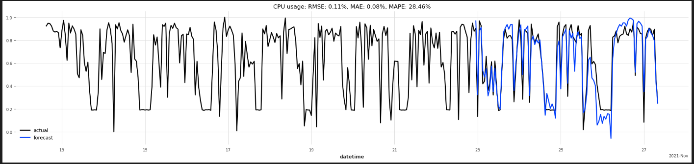

# Notebooks - 6G-NTN Resource Forecasting Repository

Welcome to the notebooks folder of the 6G-NTN Resource Forecasting repository. This folder contains various Jupyter notebooks developed to explore the data used in the project and to experiment with different forecasting models and techniques. The notebooks also include visualizations to help interpret the results effectively.



## Contents

### 1. Data Analysis

- **Notebook**: `data_analysis.ipynb`
- **Description**: This notebook provides a comprehensive analysis of the dataset used in the project. It includes data cleaning, exploration, and visualization to understand the underlying patterns and relationships in the data.

### 2. ARIMA Model

- **Notebook**: `ARIMA_model.ipynb`
- **Description**: This notebook demonstrates how to implement and train an ARIMA (AutoRegressive Integrated Moving Average) model. It includes model selection, fitting, and forecasting steps, along with the visualization of the results.

### 3. LSTM Model using TensorFlow

- **Notebook**: `LSTM_model.ipynb`
- **Description**: This notebook showcases the development of LSTM (Long Short-Term Memory) models using TensorFlow. It covers:
  - **Vanilla LSTM**: A basic implementation of an LSTM model.
  - **Complex LSTM**: An enhanced version of the LSTM model with additional layers and configurations for improved performance.

### 4. LSTM Model using Darts

- **Notebook**: `LSTM_multivariate.ipynb`
- **Description**: This notebook demonstrates the use of the Darts library to implement LSTM models for forecasting. It includes:
  - **Multivariate Forecasting**: Training an LSTM model to forecast multiple time series simultaneously.
  - **LSTM with Covariates**: Using additional covariate data to improve the forecasting accuracy of the primary time series.

## How to Use

1. **Clone the Repository**: Ensure you have cloned the repository to your local machine.
2. **Navigate to the Notebooks Folder**: Change your directory to the `notebooks` folder.
3. **Open the Notebooks**: Use Jupyter Notebook or JupyterLab to open and run the notebooks.
   ```
   jupyter notebook
   ```

## Access to Dataset

For these notebooks, we used the `amf-performance.csv` file developed in the context of [this publication](https://www.eurecom.fr/publication/6971).
The CSV file, as well as the entire dataset, can be accessed from [Zenodo](https://zenodo.org/records/6907619).

To run the notebooks, you must download the `amf-performance.csv` file and place it in the `data` directory.

### Citation
Mohamed Mekki, Nassima Toumi, & Adlen Ksentini. (2022). *Benchmarking on Microservices Configurations and the Impact on the Performance in Cloud Native Environments* (1.0) [Data set]. LCN 2022, 47th Annual IEEE Conference on Local Computer Networks, Edmonton, Canada. Zenodo. [https://doi.org/10.5281/zenodo.6907619](https://doi.org/10.5281/zenodo.6907619)

